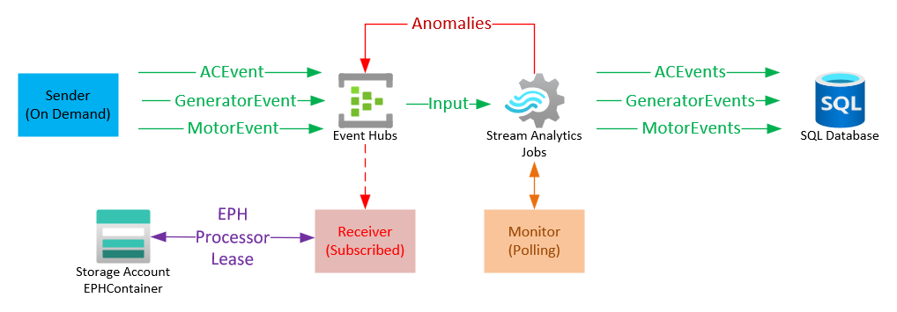

# Demo of Azure integration with Event Hubs, Azure Stream Analytics, and Azure SQL

## Problem Statement

A customer is sending messages of different types to Event Hubs and wants to save these messages to Azure SQL tables without having to write custom code.

## Solution with Stream Analytics

Azure Stream Analytics offers functionaltiy to be able to read the messages from Event Hubs, filter them, process them and saving them to different destinations including Azure SQL tables.

## Solution Diagram



## IaaS Environment Deployment

[Bicep template](deployment/main.bicep)

## Services

### Message Generator

For the purposes of this demo, the generator code has been implemented using Azure Functions with .NET Core 3.

#### Classes

```c#
public class BaseMessage
{
    public BaseMessage()
    {
        Ts = DateTime.UtcNow;
    }

    public string DeviceId { get; set; }
    public string Type { get; set; }
    public DateTime Ts { get; set; }
}

public class ACMessage : BaseMessage
{
    public ACMessage()
    {
        Type = typeof(ACMessage).Name;
    }
    public float CoolantTemperature { get; set; }
    public float AirFlow { get; set; }
    public float AirTemperature { get; set; }
}

public class GeneratorMessage : BaseMessage
{
    public GeneratorMessage()
    {
        Type = typeof(GeneratorMessage).Name;
    }
    public float Hertz { get; set; }
    public float Amps { get; set; }
    public float Voltage { get; set; }
    public float GasPercentage { get; set; }

}

public class MotorMessage : BaseMessage
{
    public MotorMessage()
    {
        Type = typeof(MotorMessage).Name;            
    }
    public float Temperature { get; set; }
    public float Revolutions { get; set; }
}
```

#### Emmiting Messages with Event Hubs

```c#
var rn = (new Random());
var rnd = rn.Next(1, 4);
float temperature = rn.Next(20, 101);
float revolutions = rn.Next(100, 301);
float voltage = rn.Next(118, 122);
float hertz = rn.Next(58, 62);
float amps = rn.Next(20, 31);
float gasPercentage = rn.Next(50, 101);
float airTemperature = rn.Next(15,31);
float airFlow = rn.Next(3, 6);

object obj = null;

if (rnd == 1)
{
    obj = new MotorMessage { DeviceId = "1X100M", Revolutions = revolutions, Temperature = temperature };
}
else if (rnd == 2)
{

    obj = new ACMessage { DeviceId = "2X100AC", CoolantTemperature=temperature, AirFlow=airFlow, AirTemperature=airTemperature};
}
else
{
    obj = new GeneratorMessage { DeviceId = "3X100G", Hertz=hertz, Amps=amps, Voltage= voltage, GasPercentage= gasPercentage };
}

// 
var options = new JsonSerializerOptions
{
    PropertyNamingPolicy = JsonNamingPolicy.CamelCase,
};
string jsonString = JsonSerializer.Serialize(obj,options);
log.LogInformation($"Message: {jsonString}");
// Create a producer client that you can use to send events to an event hub
producerClient = new EventHubProducerClient(ConnectionString);

// Create a batch of events 
EventDataBatch eventBatch = await producerClient.CreateBatchAsync();
if (eventBatch.TryAdd(new EventData(Encoding.UTF8.GetBytes(jsonString))))
    await producerClient.SendAsync(eventBatch);
else
    throw new ApplicationException("Unable to create message");
```

### Azure SQL

#### Table Definitions

```sql
create table ACMessages
(
  Id int not null primary key identity,
  DeviceId varchar(10) not null,
  Ts DateTime not null,
  CoolantTemperature float not null,
  AirFlow float not null,
  AirTemperature float not null
)

create table GeneratorMessages
(
  Id int not null primary key identity,
  DeviceId varchar(10) not null,
  Ts DateTime not null,
  Hertz float not null,
  Amps float not null,
  Voltage float not null,
  GasPercentage float not null
)

create table MotorMessages
(
  Id int not null primary key identity,
  DeviceId varchar(10) not null,
  Ts DateTime not null,
  Temperature float not null,
  Revolutions float not null
)
```

### Stream Analytics Setup

#### Input

Azure Hubs

#### Output

Azure SQL Tables:
- ACMessages
- GeneratorMessages
- MotorMessages

#### Stream Analytics Jobs

> Note: One Stream Analytic jobs instance can process many jobs. The Stream Analytics query language can perform time based operations, aggregations, etc.

```
select a.deviceId,a.ts,a.hertz,a.amps,a.voltage,a.gasPercentage
  into [hubdb-GeneratorMessages] from [hub-ecloud1-location1] a 
  where type='GeneratorMessage'
  
select a.deviceId,a.ts,a.temperature,a.revolutions
  into [hubdb-MotorMessages] from [hub-ecloud1-location1] a 
  where type='MotorMessage'
  
select a.deviceId,a.ts,a.coolantTemperature,a.airFlow,a.airTemperature
  into [hubdb-ACMessages] from [hub-ecloud1-location1] a 
  where type='ACMessage'
```` 


